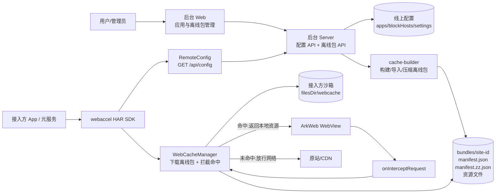
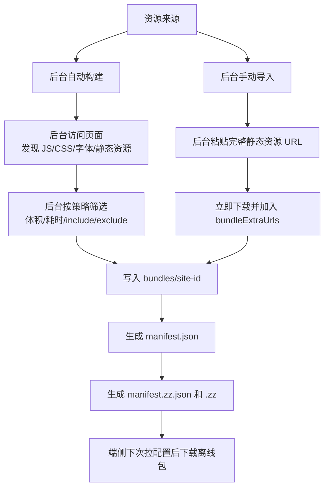
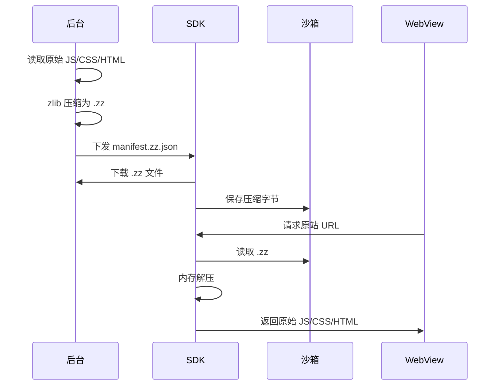
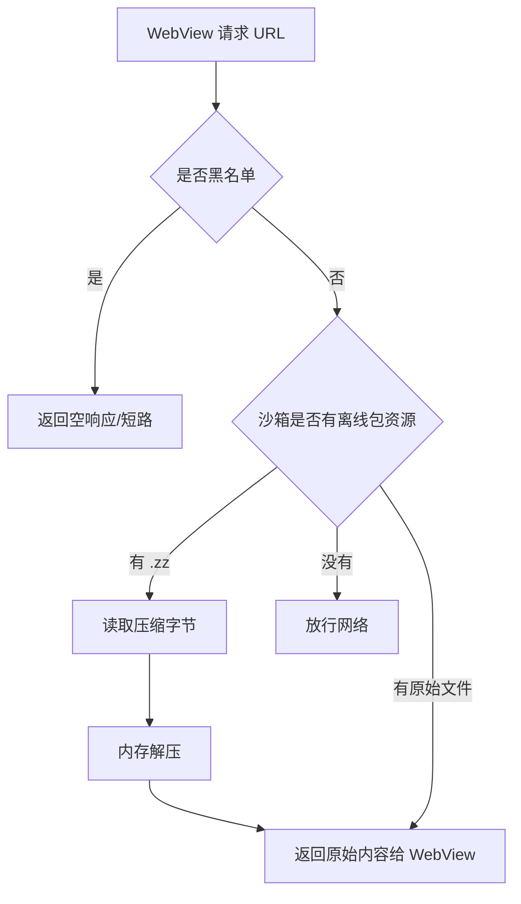
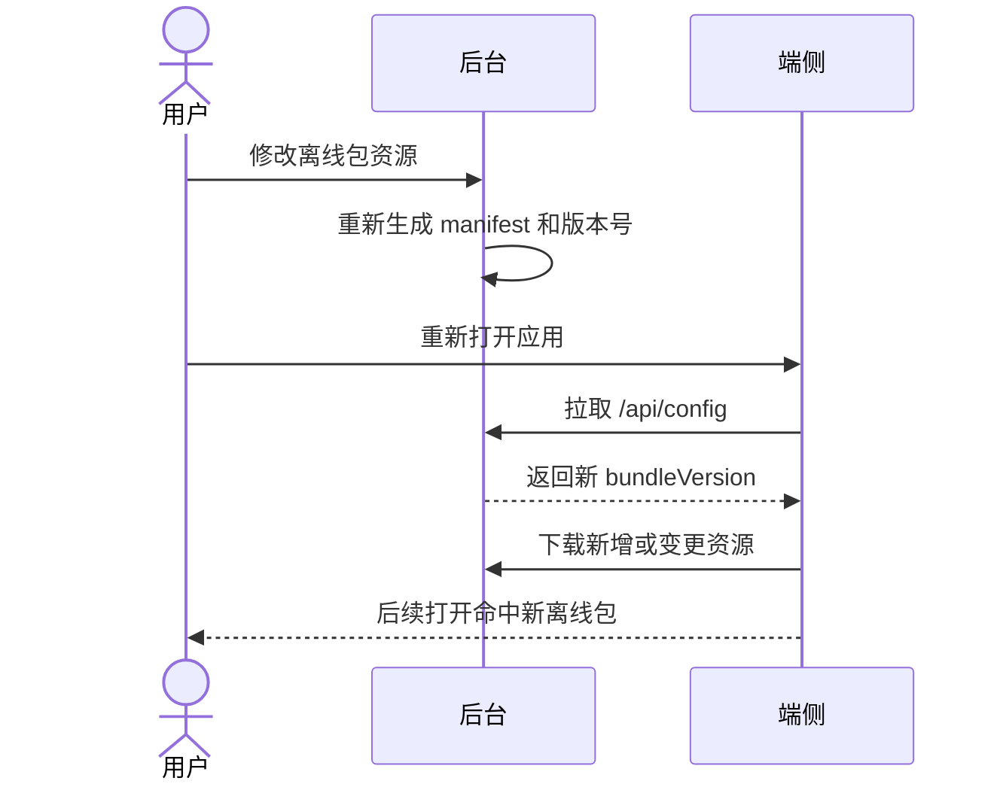

# 离线包架构说明

更新时间: 2026-07-02

当前架构只保留“后台管理离线包 + 端侧 SDK 拉包 + WebView 本地命中”。端侧不做运行时静态资源自动缓存。

## 总体架构



核心点:

1. 后台负责配置、离线包生成、压缩和托管。
2. SDK 启动后拉 `/api/config`,看到 `bundle:true` 的站点就下载 manifest 和资源。
3. 离线包落在接入方自己的沙箱 `filesDir/webcache`。
4. WebView 请求资源时,SDK 用原站 URL 做 key 拦截命中。
5. 未命中资源直接走网络,不会被端侧运行时自动缓存。

## 资源进入离线包



说明:

1. 自动构建适合服务端能稳定拿到 HTML 和静态引用的站点。
2. 手动导入适合真机发现的大资源、慢资源、关键 JS/CSS/字体。
3. `staticCache` 字段目前只作为后台筛选策略的一部分理解,端侧不再执行运行时自动缓存。

## 压缩机制



后台同时保留:

1. `manifest.json`:原始资源清单,兼容旧 SDK。
2. `manifest.zz.json`:压缩资源清单,新 SDK 优先使用。

## 端侧命中流程



命中 key 示例:

```text
https://www.rwsentosa.com/dist/rwsentosarevamp/static/js/4.357b4384.chunk.js
```

即使资源文件来自后台:

```text
/bundles/rwsentosa/...
```

WebView 请求时仍按原站 URL 命中。

## 更新流程



当前不是后台实时推送。端侧想不重启就拿新配置,需要接入方主动调用:

```ts
WebAccel.refreshConfig()
```

## 当前线上重点站点

| 站点 | ID | 离线包 | 资源数 | 原始大小 | 端侧落盘 | 资源来源 |
|---|---|---:|---:|---:|---:|---|
| 新加坡环球影城 | `rwsentosa` | 开启 | 27 | 11265.9 KB | 7116.3 KB | 手动固定 JS/CSS/字体 |
| K11 香港 | `k11` | 开启 | 11 | 4962.9 KB | 4962.9 KB | 可稳定下载的大图 |
| 印尼出境卡 | 见后台配置 | 开启 | 36 | 1566.5 KB | 606.7 KB | 首页 + 表单页关键资源 |
| Booking.com | 见后台配置 | 开启 | 24 | 10251.2 KB | 2631.9 KB | 真机采集 static.booking.cn / ac-a.static.booking.cn |

RWS 资源说明:

1. 已缓存 JS、CSS、中文字体和站点字体。
2. 未缓存 MP4 视频和动态接口。
3. 页面慢不完全等于资源下载慢;还包括 JS 执行、字体排版、图片/视频渲染。

## 调试与验证

浮窗显示:

```text
包准备中
包下载 x/y
包完成 x/y
未配置离线包
```

日志判断:

```text
cache STORE ... bundle      # 正确,来自后台离线包
cache STORE ... runtime     # 当前版本不应再出现
```

首装或重装后沙箱为空。应等待目标站点显示 `包完成 x/y` 后再验证页面速度。

## 风险与兜底

1. 系统清理沙箱、用户清除应用数据、重装应用会清掉本地离线包。
2. 离线包丢失后页面回退走网络,不会直接打不开。
3. 下次 SDK 初始化会重新从后台下载离线包。
4. 后台离线包资源坏了或源站变更,需要后台重新构建或导入新资源。
5. 后续如需断点续传,需要后台支持 Range 请求,端侧保存 `.part` 临时文件、偏移和 hash 校验。
