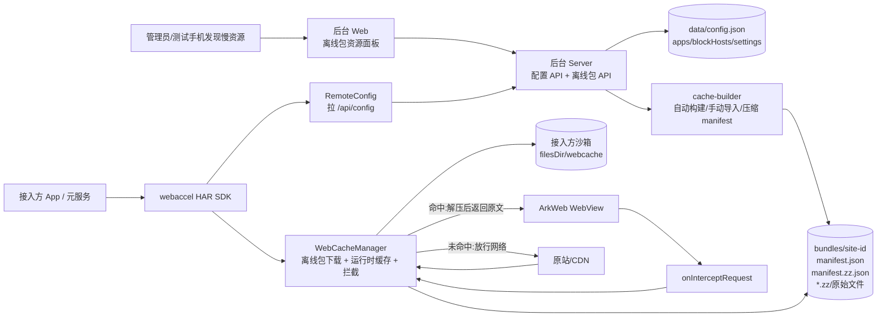
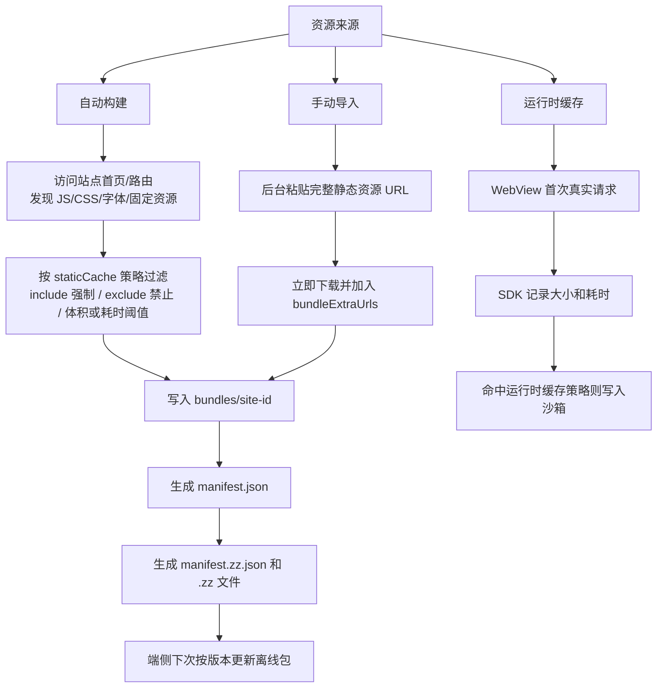
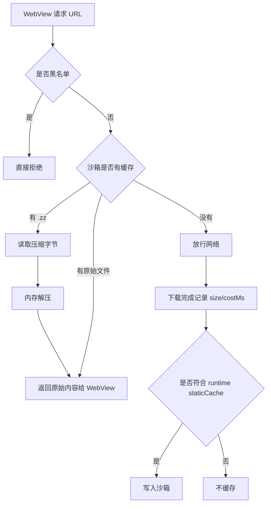

# 离线包与资源缓存架构说明

更新时间: 2026-07-01

本文说明当前线上机制:SDK 只负责让关键静态资源获取更快,页面解析和渲染仍交给 WebView 内核。当前三站均关闭 `prerender` / `swrDoc` / `codeCache` / `prefetchChunks`,全局关闭 `bytecodeCache`。

## 总体架构



核心点:

- 后台负责配置、离线包生成、压缩和托管。
- SDK 启动后拉 `/api/config`,看到 `bundle:true` 的站点就下载对应 manifest 和资源。
- 离线包落在接入方自己的沙箱 `filesDir/webcache`,不是打进 HAP,也不是写到我们 demo App。
- WebView 请求资源时,SDK 用原站 URL 做 key 拦截命中。
- 后台 `/bundles/...` 只是下载源,真正命中时仍按网页原始 URL 匹配。

## 资源进入离线包的方式



### 自动构建

适合 K11、印尼出境卡这类服务端能稳定拿到 HTML 和静态资源引用的站点。构建逻辑会发现 JS/CSS/字体等静态资源,再按每站 `staticCache` 策略过滤。

策略顺序:

1. `exclude` 命中:禁止缓存。
2. `include` 命中:强制缓存。
3. `maxSizeKB` 超过:跳过。
4. `minSizeKB` 或 `minDurationMs` 任一命中:保留。

### 手动导入

适合真机发现的资源,例如 Booking 首页加载出的 `static.booking.cn` 大 JS/CSS。后台入口:

```text
离线包资源面板 -> 选择网站 -> 导入资源 -> 每行粘贴一个 URL
```

导入后立即执行:

- 下载指定 URL。
- 写入该站 `bundles/<id>/`。
- 加入该站 `bundleExtraUrls`。
- 自动开启该站 `bundle:true`。
- 重新生成 `manifest.json` 和 `manifest.zz.json`。
- 后台明细显示文件名、原始大小、端侧占用、下载耗时、状态。

手动导入会信任管理员判断,不强制要求文件名带 hash。导入前仍要确认这是静态资源,URL 稳定,不是动态接口、会话数据、风控响应或搜索结果。

### 运行时缓存

当资源没有进离线包时,WebView 第一次真实请求仍会走网络。SDK 下载完成后会记录资源大小和耗时,如果符合该站 `staticCache` 策略,就写入沙箱。下一次同 URL 请求可本地命中。

运行时缓存适合补充离线包漏掉的稳定静态资源,不适合依赖它实现第一次打开秒开。

## 压缩机制


后台同时保留两份 manifest:

- `manifest.json`:原始资源清单,兼容旧 SDK。
- `manifest.zz.json`:压缩资源清单,新 SDK 优先使用。

端侧占用的含义:

- `原始大小`:资源真实大小,也就是 WebView 最终拿到的 JS/CSS/HTML 原文大小。
- `端侧占用`:SDK 实际下载并存进沙箱的大小。文本资源通常是 `.zz` 压缩后大小;图片/字体这类本身已压缩的资源通常等于原始大小。

当前没有把压缩字节直接用 `Content-Encoding` 返回给 ArkWeb。实测这种方式可能让 ArkWeb 把压缩字节当 JS 解析,出现语法错误。因此当前方案是“沙箱压缩存储,命中前内存解压,返回原文”。

## 端侧命中流程



命中 key 是原站 URL。例如:

```text
https://ac-a.static.booking.cn/psb/capla/static/js/client.a8fa8310.js
```

即使资源文件来自后台:

```text
/bundles/booking/ac-a.static.booking.cn_psb_capla_static_js_client.a8fa8310.js.zz
```

WebView 请求时仍然按第一条原站 URL 命中。

## 版本更新

后台生成 manifest 后会按内容算版本:

- `bundleVersion`:原始 `manifest.json` 内容指纹。
- `compressedBundleVersion`:压缩 `manifest.zz.json` 内容指纹。

SDK 拉 `/api/config` 后,如果发现站点版本变化,会重新下载该站离线包。导入或移除资源都会导致版本变化。

## 当前线上状态

当前线上只保留三站测试配置,所有页面渲染相关能力关闭,只验证资源缓存链路。离线包不是“全量静态资源”,而是按真机日志里暴露出来的大资源、慢资源和关键路由 chunk 手动导入。

| 站点 | 离线包 | 资源数 | 原始大小 | 端侧占用 | 上限 | 资源来源 |
|---|---:|---:|---:|---:|---:|---|
| K11 香港 | 开启 | 11 | 4962.9 KB | 4962.9 KB | 7000 KB | 首页/店铺/美食真机分析,仅保留可正确下载的大图 |
| 印尼出境卡 | 开启 | 36 | 1566.5 KB | 606.7 KB | 4096 KB | 首页 + BC32/BC34 表单页真机分析,包含关键路由 chunk |
| Booking.com | 开启 | 24 | 10251.2 KB | 2631.9 KB | 8192 KB | 真机采集后手动导入 static.booking.cn/ac-a.static.booking.cn 静态 JS/CSS |

三站当前离线包端侧占用合计约 `8201.5 KB`,还会叠加运行时缓存、索引文件和后续新增站点占用。全局沙箱预算当前为 `160 MB`,超过后 SDK 会按 LRU 淘汰旧资源。

### 首装/重装后的第一次进入

重新安装后接入方沙箱为空。SDK 启动后会根据 `/api/config` 逐站下载离线包,当前会依次下载 K11、印尼出境卡、Booking 的压缩 manifest 和资源。若用户刚启动就立刻进入某个页面,该站离线包可能还没有下载/解压完成,页面请求到尚未落盘的 chunk 时仍会走网络,表现为首次进入卡顿。

验证离线包效果时应区分两种状态:

- 离线包下载中:调试浮窗会显示 `包 done/total`,此时首次进入可能仍慢。
- 离线包已完成:对应站点显示 `包 total/total`,再次进入页面才是离线包命中速度。

Booking 这类 CDN-heavy 站点的静态资源主要在 `ac-a.static.booking.cn` 或 `static.booking.cn`,不是主站 origin。若某个调试页面只按主站 origin 统计“缓存条数”,可能显示 0;应以离线包进度 `包 24/24`、总沙箱条数和 `WebCache` 日志里的 `cache STORE ... bundle zlib` 为准。

## Booking 的特殊处理

Booking 首页不能靠服务端自动构建离线包,因为后台直接请求首页会被 AWS WAF challenge 拦住,拿不到真实 HTML。当前 Booking 离线包是“真机采集型”:

1. 清应用缓存,安装真机包。
2. 真实打开 Booking 首页。
3. 从 SDK 日志提取 `cache STORE/SKIP` 中的静态资源大小和耗时。
4. 筛选 `>=64 KB` 或 `>=3000 ms` 的静态资源;对页面入口必须依赖的路由 chunk,即使低于阈值也可手动导入。
5. 通过后台手动导入。
6. 生成压缩离线包并验证端侧下载。

本轮导入的 Booking 资源全部来自:

```text
https://ac-a.static.booking.cn/psb/capla/static/js|css/...
```

导入结果:

- 24 个 JS/CSS。
- 原始大小 `10251.2 KB`。
- 端侧压缩落盘 `2631.9 KB`。
- 端侧日志已确认 `remote bundle: total 24, to download 24`。

## 后台控制点

- `bundle`:是否启用该站离线包。关闭后端侧不会预下载该站 manifest。
- `bundleMaxSizeKB`:单站离线包原始资源上限。
- `bundleExtraUrls`:手动固定资源。导入成功会自动写入这里。
- `bundleExcludeUrls`:排除资源。资源面板关闭某资源会写入这里。
- `staticCache.include`:运行时或构建时强制缓存匹配项。
- `staticCache.exclude`:禁止缓存匹配项。
- `staticCache.minSizeKB`:大于等于该体积才缓存。
- `staticCache.minDurationMs`:下载耗时大于等于该值才缓存。
- `staticCache.maxSizeKB`:单资源最大缓存体积。
- `blockHosts` / `extraBlockHosts`:全局/单站黑名单,用于拒绝统计、广告、遥测、风控噪声。

## 操作建议

新增资源时按这个顺序:

1. 真机清缓存后打开目标页面。
2. 看 `WebCache` 日志里的 `cache STORE/SKIP <大小> B <耗时> ms <URL>`。
3. 只选静态 JS/CSS/图片/字体,优先 `>=64 KB` 或 `>=3000 ms`;路由页面入口 chunk 可按页面必需性补充导入。
4. 在后台导入资源。
5. 看离线包端侧占用是否合理。
6. 重启 App,确认日志出现该站 `remote bundle` 和对应 `cache STORE ... bundle zlib`。
7. 再次进入页面,确认资源本地命中。

不要导入:

- 搜索接口、用户态接口、订单/表单接口。
- 带 token/session/random 参数的 URL。
- 风控挑战响应。
- 埋点、广告、遥测脚本。
- 体积大但不影响首屏的低价值资源。
