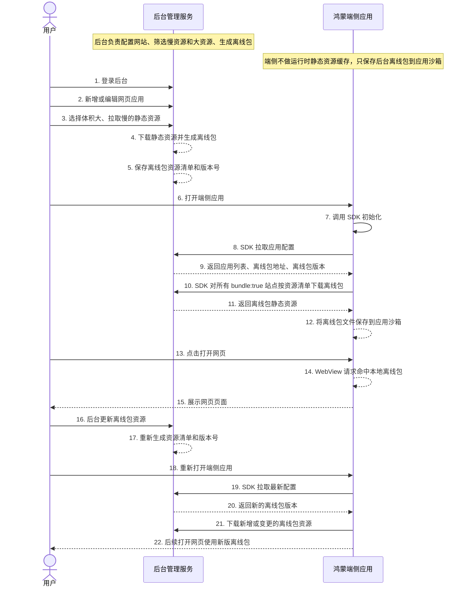

# 用户、后台、端侧离线包交互时序图

下面是简化后的 Mermaid 时序图代码，可复制到 Mermaid Live Editor 或在线转换网站生成图片。

## 三方作用

1. 用户：在后台配置网页应用、选择需要进离线包的资源，并在端侧打开页面验证效果。
2. 后台管理服务：负责分析资源、下载资源、生成离线包、保存版本号，并给 SDK 提供配置和离线包文件。
3. 鸿蒙端侧应用：只负责 SDK 初始化、拉取配置、下载后台离线包、让 WebView 命中本地离线包。

## 关键规则

1. 端侧不再做“用户访问后自动缓存静态资源”的功能，避免出现点过页面后端侧自己缓存一批资源。
2. 端侧仍然需要把后台离线包文件保存到应用沙箱，否则 WebView 无法本地命中；这属于“离线包落盘”，不是“端侧自动抓取缓存”。
3. 服务端配置拉取成功后，所有 `bundle:true` 且有 manifest 的站点都会进入下载队列；本地旧配置只兜底展示，不触发全量下载。
4. 后台更新离线包后，端侧需要重新打开应用或重新执行 SDK 初始化，才能拉取新版本配置并下载新离线包。
5. 如果要做到后台修改后端侧实时更新，需要后续增加推送、长连接或定时轮询；当前流程不做实时强推。
6. 应用沙箱有容量限制，按约 200MB 预算控制；后台必须控制每个站点离线包大小，优先放 JS、CSS、字体等关键慢资源。
7. 如果系统清理应用沙箱、用户清除应用数据或重装应用，端侧本地离线包会丢失；下次 SDK 初始化会重新从后台下载。
8. 断点续传可以后续做，目前先按资源文件重试；真正断点续传需要后台支持 Range 请求，端侧保存临时分片和下载进度。

## 不做的能力

1. 不做端侧运行时静态资源自动缓存。
2. 不做端侧根据体积或耗时自行决定缓存。
3. 不做预渲染。
4. 不做 SWR 主文档缓存。
5. 不把离线包直接打进 HAP 包体。
